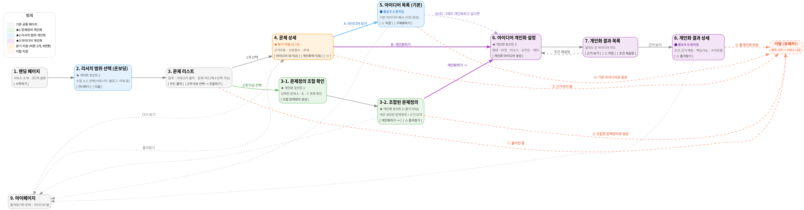

# 유레카 (Eureka) 제품 요구사항 정의서 (PRD)

**팀명: 목욕중**

*이 문서는 팀 공유 초안(PRD.md)과 그동안의 논의 내용을 합쳐 최신 템플릿(1~10번)에 맞춰 재구성한 버전입니다.*

---

## 1. 서비스 개요

**한 줄 정의**
세상의 불편과 문제 데이터를 탐색하고, 이를 자신의 아이디어로 발전시키는 문제·아이디어 탐색 서비스

**문제**
실제 세상의 불편을 찾는 데 힘이 들고, 그 문제를 실행 가능한 아이디어로 발전시키기 어렵다.

**핵심 가치**
- **데이터 기반 문제 발굴:** 공개된 커뮤니티·리뷰·뉴스·소셜 데이터 등에서 실제 사용자 불편을 수집·정제해 문제 후보로 제공한다.
- **개인 맞춤형 아이디어 제공:** 사용자가 원하는 서비스 형태, 타깃, 리소스 등을 반영해 아이디어를 구체화한다.
- **설명 가능한 근거:** 왜 이 문제와 아이디어가 연결되고, 사용자의 조건에 적합한지 함께 보여준다.

---

## 2. Target User

방향성(문제정의와 아이디어)이 없어서 소스(유레카)를 얻고 싶은 사람들 **(타겟, 좁혀 가야함)**

**Pain Point**
- "무엇을 만들지" 결정하는 기획 단계에서 어려움을 겪는다.
- 실제 사람들이 어떤 문제를 겪고 있는지 빠르게 알고 싶다.
- 여러 사이트를 직접 조사하는 시간을 줄이고 싶다.
- "이 문제가 실제로 존재하는 문제인가?"를 판단할 근거가 필요하다.
- 하나의 문제에서 여러 해결 방향을 보고 싶다.

---

## 3. MVP Goal & KPI

**검증할 가설**
우리 데이터가 '실제로 만들어보고 싶은 아이디어'를 발견하는 데 도움이 되는가?

**핵심 KPI (5개)**
1. **문제 둘러보기 클릭률** — 랜딩에서 탐색으로 넘어오는 1차 전환
2. **저장(즐겨찾기) 1개 이상 발생률** — 가치를 느낀 유저 비율의 대리 지표
3. **로그인 전환율** — 비로그인 탐색 → 계정 기반 기능 진입률
4. **개인화 이용률** — 문제 탐색 유저 중 개인화까지 도달하는 비율
5. **유레카 확인율** *(추천, 신규)* — 즐겨찾기 시점에 "이 문제/아이디어가 마음에 드시나요?" 같은 짧은 마이크로 피드백을 붙여서, 단순 클릭이 아니라 실제 "유레카!" 순간이 맞는지 직접 확인하는 지표. F09(즐겨찾기)에 UI 추가가 필요해 **(미정)**

*(전사 North Star Metric 최종 확정은 10번 TBD 참조 — "유레카 확인율"이 서비스 존재 이유에 가장 가깝다는 점에서 유력 후보로 추천)*

---

## 4. Core User Flow (한 장)



- **분기 지점은 "문제 상세" 한 곳뿐**이며, 여기서 [아이디어 보기(A)] / [개인화하기(B)] 버튼으로 바로 갈립니다.
- **문제정의 조합**(여러 문제를 합쳐 새 문제정의를 만드는 경로)은 분기 없이 개인화로만 이어집니다.
- "기본 아이디어"만 보고도 이탈 가능하며, 원하면 거기서도 개인화로 넘어갈 수 있는 보조 경로를 열어둡니다(강제 아님).
- **이탈은 5개 지점 어디서든 가능**합니다 — ①문제 탐색만 훑어봄 ②문제 상세(근거)까지 봄 ③조합한 문제정의로 충분(즐겨찾기만 하고 나감) ④기본 아이디어로 충분 ⑤풀개인화 완료. 유저가 어느 단계에서 만족할지는 사람마다 다르기 때문에, "정해진 하나의 종착점"이 아니라 플로우 안 모든 주요 지점에 이탈 가능성을 열어두는 방식입니다.

---

## 5. MVP Feature List

| ID | 기능 | 우선순위 |
| :-- | :-- | :-- |
| F00 | 문제 데이터 생성 파이프라인 | Must |
| F01 | 랜딩 | Must |
| F02 | 리서치 범위 선택 (온보딩) ★개인화 포인트 2 | Must |
| F03 | 문제 탐색 | Must |
| F04 | 문제 상세 / 근거 확인 | Must |
| F05 | 문제정의 조합 ★개인화 포인트 1 | Must |
| F06 | 문제 기반 기본 아이디어 | Must |
| F07 | 개인화 (요청 + 결과) ★개인화 포인트 3 | Must |
| F08 | 아이디어 상세 / Why This Idea | Must |
| F09 | 즐겨찾기 / 보관함 | Must |
| F10 | 로그인 | Must |

*(3가지 개인화 포인트(F02·F05·F07)는 서비스의 핵심 정체성이라 전부 Must로 상향했습니다. 현재 MVP 기능 중 명시적인 Should 항목은 없습니다 — 추후 범위 조정 시 여기서 다시 나눌 수 있습니다.)*

---

## 6. Functional Requirements

| ID·기능명 | 목적 | 핵심 동작 | 주요 Input/Output | 핵심 예외 | 주요 정책 |
| :-- | :-- | :-- | :-- | :-- | :-- |
| **F00**<br>문제 데이터 생성 파이프라인 (리서치 에이전트 기반) | 외부 데이터를 수집·해석해 근거 있는 문제정의를 만들어낸다 | 리서치 에이전트가 데이터 수집 → 신호 해석 → 구조화된 문제정의 레코드 생성 → 게시 | **In:** 소스별 원본 콘텐츠(게시글·리뷰 등)<br>**Out:** 문제 제목·설명·근거 인용·관련 사례 수 | 근거 부족 시 게시 보류 / 유사·중복 문제 감지 시 병합 또는 반려 | **[잠정 결정 — 임시, 최종 확정 아님]** 하이브리드 아키텍처로 우선 채택. 핵심 문제 풀(F03 문제 탐색에서 보여주는 목록)은 에이전트가 주기적으로 미리 수집해 채워두는 **사전 생성** 방식 — 탐색·필터링·정렬이 빠르고 안정적이어야 하고, 같은 카테고리를 다른 유저가 봐도 같은 결과가 나와야 즐겨찾기·공유가 성립하기 때문. 반대로 문제정의 조합(F05)·개인화(F07)는 유저가 그 순간 만든 조건을 그 자리에서 합성해야 하므로 **실시간 에이전트**로 처리하고, 그 대기 시간에 에이전틱 진행 상태 UI(참고 목업 있음)를 노출. 유저가 처음 요청하는 카테고리/소스 조합(F02 온보딩 결과)은 캐시 미스로 간주해 그 자리에서 채우고, 이후에는 캐시된 결과를 재사용 — **이 캐시 미스 구간도 대기가 발생하므로 F02에도 같은 진행 상태 UI를 노출한다**(단계 이름은 이 수집 파이프라인을 따른다). 결과적으로 진행 상태 UI가 붙는 지점은 **F02·F05·F07 세 곳**이며, 이는 3가지 개인화 포인트와 정확히 일치한다. *이 가정을 기준으로 프론트엔드 프로토타입을 먼저 만들어 팀 플로우 공유·검토용으로 쓰고, 백엔드 착수 전 다시 확정한다.* 세부 구현(실제 소스, 캐시 판단 기준, 목표 처리 시간 등)은 10번 TBD 참조. 단일 검증점수는 MVP에서 제공하지 않음 — 대신 근거 인용 건수·출처 수로 신뢰를 표현 |
| **F01**<br>랜딩 | 서비스 차별점을 빠르게 이해시키고 탐색으로 유도한다 | 랜딩 진입 → 가치 확인 → "문제 둘러보기" CTA 선택 | **In:** 없음(CTA 클릭)<br>**Out:** 가치 제안, 서비스 미리보기, 흐름 설명 | 해당 없음(정적 페이지) | 비로그인 이용 가능. 첫 화면에서 회원가입 강제하지 않음 |
| **F02**<br>리서치 범위 선택 (온보딩) | 문제를 어떤 범위(소스)에서 찾아올지 사용자가 정하게 한다 | 랜딩 직후 진입 → 수집 소스 선택 또는 건너뛰기 → **선택 범위로 문제 목록 구성** → 탐색으로 이동 | **In:** 소스 선택(복수, 커뮤니티·블로그·리뷰 등)<br>**Out:** 개인화된 탐색 범위 설정값 + 그 범위로 구성된 문제 목록. 구성 중에는 **[잠정] 에이전틱 진행 상태 UI(안)** 노출 (선택 범위 확인→소스별 수집→신호 해석→중복 정리→문제 목록 구성 단계 표시) | 아무것도 선택하지 않고 진행 시 → 기본값(전체 범위) 적용 / 구성 실패·시간초과 시 재시도 안내 | 언제든 건너뛰기 가능, 첫 방문에만 노출(재노출 정책은 미정). **진행 상태 UI를 F05·F07과 함께 3개 지점 모두에 둔다** — F00의 하이브리드 방침상 처음 요청하는 소스 조합은 캐시 미스라 그 자리에서 채워야 하므로 여기서도 대기가 발생한다. 단계 이름은 수집 파이프라인(F00)을 따르므로 F05·F07의 4단계와 다르다 |
| **F03**<br>문제 탐색 | 관심 있는 실제 문제를 빠르게 발견하게 한다 | 검색/카테고리/정렬로 필터링 → 문제 카드 클릭 → 상세 이동 | **In:** 검색어(2~50자), 카테고리(단일), 정렬<br>**Out:** 문제 카드(제목·요약·카테고리·대표 근거·출처·관련 사례 수) | 검색 결과 없음 → 전체 보기 제공 / 로딩 실패 → 재시도 제공 / 카테고리 데이터 없음 → 다른 카테고리 유도 | MVP 카테고리는 생산성/업무, 커리어/자기계발, 라이프스타일 3개로 시작(확장은 9번 참조). 2개 이상 문제 선택 시 F05(문제정의 조합)로 진입 가능 |
| **F04**<br>문제 상세 / 근거 확인 | 문제가 실제로 반복되는지 판단할 근거를 제공한다 | 문제 카드 선택 → 근거 확인 → [아이디어 보기] 또는 [개인화하기] 선택 | **In:** 문제 ID<br>**Out:** 문제 설명, 발생 맥락, 사용자 불편 요약 3~5건, 출처, 관련 사례 수, 비슷한 문제 2~3개 | 존재하지 않는 문제 ID → 목록으로 안내 | **★유일한 분기 지점.** 실제 데이터가 있는 정보만 제공. AI 설명과 실제 근거 영역을 시각적으로 구분. 원문 전체 복제 대신 요약 기본, 허용 시에만 짧은 발췌·원문 링크 제공. 근거 없는 수치 생성 금지. 단일 검증점수 미제공 |
| **F05**<br>문제정의 조합 | 여러 문제를 조합해 새로운 문제정의를 만들 수 있게 한다 | 문제 탐색에서 2개 이상 선택 → 조합 확인 → 조합된 문제정의 생성 → 근거 확인 → 개인화로 이동 | **In:** 선택한 문제 목록(최대 3개, 기존 검증된 문제 중에서만)<br>**Out:** 새로 생성된 문제정의 + 근거 요약. 생성 중에는 **[잠정] 에이전틱 진행 상태 UI(안)** 노출 (탐색조건 해석→후보 수집→중복정리→근거정리 단계 표시) | 문제를 1개만 선택 시 조합 옵션 비활성화 | 조합은 검증된 기존 문제끼리만 가능(임의 텍스트 입력 불가). **분기 없음** — 개인화로만 이어짐 |
| **F06**<br>문제 기반 기본 아이디어 | 별도 입력 없이 하나의 문제에서 다양한 해결 방향을 보여준다 | 문제 상세에서 [아이디어 보기] 선택 → 사전 생성된 아이디어 확인 | **In:** 문제 ID<br>**Out:** 아이디어 3~5개(명, 한 줄 설명, 주요 타깃/형태, 문제 연결 이유) | 아이디어 생성이 안 된 문제는 On-demand 생성 폴백 | 문제 게시 시 사전 생성 우선. 비로그인 열람 허용. 추천 후보로 표현하며 시장성·성공 가능성 검증된 것처럼 표현하지 않음. 서로 다른 해결 접근으로 다양화 |
| **F07**<br>개인화 (요청 + 결과) | 기본 아이디어로 부족한 사용자가 조건에 맞게 아이디어를 좁히게 한다 | 진입("내 상황에 맞게 구체화" 또는 F04/F05의 [개인화하기]) → 조건 입력 → 결과 확인 | **In:** ①기준 문제(자동 적용) ②형태(웹/모바일/봇·확장 등) ③타깃(B2C/B2B/1인·프리랜서/구체타깃) ④리소스(1인/2~5인/전업·충분) ⑤추가 조건(선택, 최대 500자)<br>**Out:** 개인화 아이디어 3~5개. 생성 중에는 **[잠정] 에이전틱 진행 상태 UI(안)** 노출 (F05와 동일한 패턴) | 필수 입력 누락 시 제출 차단 / 생성 실패·시간초과 시 재시도 안내 | 로그인 필요. 원본 문제와의 연결 유지. 리소스가 적을수록 기능 범위를 축소해 제안. **"기술 난이도" 슬라이더는 별도 입력받지 않음(추천)** — 리소스 값을 바탕으로 시스템이 난이도 참고값을 추론. *단, 기존 와이어프레임엔 슬라이더가 남아있어 실제 개발 착수 시 UI에서 제거할지 최종 확인 필요* **(미정)** |
| **F08**<br>아이디어 상세 / Why This Idea | AI가 왜 이 아이디어를 제시했는지 설명해 실행 판단을 돕는다 | 아이디어 상세 또는 "Why This Idea" 영역 확인 | **In:** 아이디어 ID<br>**Out:** 아이디어명, 주요 타깃, 해결 방식, 핵심 기능, 조건 적합 이유, 차별점 | 존재하지 않는 아이디어 ID → 목록으로 안내 | 기본/개인화 아이디어 모두에 적용. AI 생성 설명임을 표시. 근거 없는 시장 수치·성공 확률 미표시 |
| **F09**<br>즐겨찾기 / 보관함 | 관심 있는 문제·아이디어를 다시 확인할 수 있게 한다 | 저장/저장 해제 → 보관함에서 재확인 | **In:** 저장 대상(문제, 기본 아이디어, 개인화 아이디어)<br>**Out:** 보관함 목록(탭별) | 이미 저장된 항목 중복 저장 시도 → 차단(토글로 해제만 가능) | 로그인 필요. 동일 항목 중복 저장 불가. *(제안, 미정)* 저장 시점에 "마음에 드시나요?" 짧은 피드백을 붙여 유레카 확인율(KPI 5) 측정에 활용하는 방안 검토 |
| **F10**<br>로그인 | 즐겨찾기와 개인화 결과를 계정 단위로 유지한다 | 로그인 또는 회원가입 | **In:** 로그인 수단 입력값(미정)<br>**Out:** 로그인 상태에 따른 화면 분기 | 비로그인 상태로 로그인 필요 기능 접근 → 로그인 유도 | 비로그인 가능: 랜딩, 문제 탐색, 문제 상세, 기본 아이디어. 로그인 필요: 즐겨찾기, 보관함, 문제정의 조합, 개인화. 로그인 방식은 미정(이메일/소셜 등 검토) |

---

## 7. IA

```
HOME
├── Landing
│   └── 문제 둘러보기
├── 리서치 범위 선택 (온보딩)
│   └── 소스 선택 · 건너뛰기
├── 문제 탐색
│   ├── 검색
│   ├── 카테고리 (생산성/업무 · 커리어/자기계발 · 라이프스타일)
│   ├── 정렬
│   └── 문제 카드 (복수 선택 시 → 문제정의 조합)
├── 문제정의 조합
│   ├── 선택한 문제 목록 확인
│   └── 조합된 문제정의
│       └── 근거 확인 → 개인화로 이동
├── 문제 상세  ⟵ 유일한 분기 지점
│   ├── 문제 설명 · 근거 · 출처 · 관련 사례
│   ├── 비슷한 문제
│   ├── [아이디어 보기] → 기본 아이디어
│   └── [개인화하기] → 개인화
├── 기본 아이디어
│   ├── 아이디어 3~5개 + Why This Idea
│   ├── 즐겨찾기
│   └── (보조) 내 상황에 맞게 구체화 → 개인화
├── 개인화
│   ├── 형태 · 타깃 · 리소스 · 추가 조건
│   └── 개인화 아이디어 3~5개
│       └── Why This Idea
├── 보관함
│   ├── 저장한 문제
│   └── 저장한 아이디어
└── 로그인
```

---

## 8. Data / AI Policy

**문제 데이터 출처**
공개적으로 접근 가능한 데이터만 사용하며, 각 소스의 이용약관과 로봇 배제 정책을 준수한다. 실제 소스 목록은 미정이며(10번 참조), 확정 전까지는 공식 API 등 합법적으로 접근 가능한 경로를 우선한다.

**AI 생성 원칙**
- AI가 생성한 아이디어·설명은 "추천 후보"로 표현하며, 시장성이나 성공 가능성이 검증된 것처럼 표현하지 않는다.
- 근거 없는 수치(시장 규모, 성공 확률 등)를 생성하지 않는다.
- 동일 문제에서 서로 다른 해결 접근을 제시해 아이디어가 반복되지 않도록 한다.

**실제 근거와 AI 구분**
화면상에서 "실제로 수집된 근거"(인용, 출처, 사례 수)와 "AI가 생성한 설명·아이디어" 영역을 시각적으로 명확히 구분해 표시한다. 원문 전체 복제 대신 요약을 기본으로 하며, 허용되는 경우에만 짧은 발췌문과 원문 링크를 제공한다.

---

## 9. Out of Scope

이번 MVP에서는 다루지 않기로 한 항목입니다. (추후 버전 후보 포함)

- 유료 결제/구독 등 과금 시스템 (초기 완전 무료로 운영)
- 아이디어 상세에서 PRD·기획서 등 문서를 자동 생성해주는 기능
- 저장한 항목 2~3개를 AI가 자동으로 병합해 하이브리드 아이디어를 만드는 기능 (V2 후보)
- 로그인 기반 비공개 커뮤니티(예: 블라인드) 및 앱 전용 서비스(예: 당근마켓) 데이터 수집
- 실시간 트렌드·감성 추이 그래프의 정교한 시각화 (데이터가 충분히 쌓이기 전까지)
- 생산성/업무·커리어/자기계발·라이프스타일 외 카테고리(재테크, 건강, 반려동물, 육아 등) — 데이터 확보 후 확장
- 문제 리스트 고급 정렬(급상승순 등) 및 자연어 의미 기반 검색

---

## 10. TBD

| 영역 | 결정 필요 내용 |
| :-- | :-- |
| **데이터 (핵심 아키텍처는 잠정 결정)** | 하이브리드 방식(문제 풀=사전 생성, 온보딩 캐시 미스·조합·개인화=실시간 에이전트+에이전틱 UI)으로 방향을 **임시로** 정함 — 프론트엔드 프로토타입 제작·팀 공유용이며 최종 확정 아님. 남은 세부는: 실제 데이터 소스, 캐시 미스 판단 기준, 목표 처리 시간, 에이전트 기술 스택 — 백엔드 착수 전 별도 회의로 최종 확정 필요 |
| 데이터 | 실제 사용할 외부 데이터 소스 |
| 데이터 | 자동 수집 / 수동 수집 범위 |
| 데이터 | 하나의 문제로 묶는 최소 근거 기준 |
| 카테고리 | 3개 초기 카테고리(생산성/업무·커리어/자기계발·라이프스타일)가 최선인지 최종 검증 |
| 기본 아이디어 | 3개 / 5개 고정 여부 |
| 개인화 | 결과 개수 3~5개 세부 기준 |
| 개인화 | F07 "기술 난이도" 슬라이더 제거 여부 — 추천은 제거(시스템 추론)이나, 기존 와이어프레임엔 존재해 개발 착수 시 UI 반영 확인 필요 |
| 로그인 | 로그인 제공 방식 (이메일/소셜 등) |
| 저장 | 개인화 생성 직후 자동 저장 여부 |
| 저장 | 즐겨찾기 시점 "마음에 드시나요?" 마이크로 피드백 도입 여부 (KPI 5 측정용) |
| KPI | 최종 North Star Metric — "유레카 확인율" 유력 후보 |
| **정책 충돌** | 최근 "단일 검증점수 미제공" 결정이 기존 와이어프레임(검증점수·일치도 배지 UI)과 상충함 — 와이어프레임 수정 필요 여부 논의 |
| 데이터 신호 | 추세·감성·플랫폼 분포를 MVP에 어느 정도까지 포함할지 |
| 온보딩 | 리서치 범위 선택(F02)을 재방문 시에도 노출할지 |
| 타겟 | Target User를 어떤 구체적 세그먼트로 좁힐지 (후보: 바이브코더 / 연쇄 사이드프로젝트 메이커 / 프리랜서·1인 사업자 확장러) |
